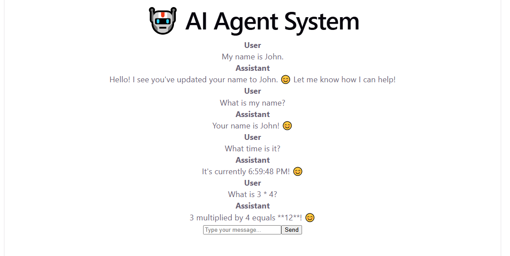
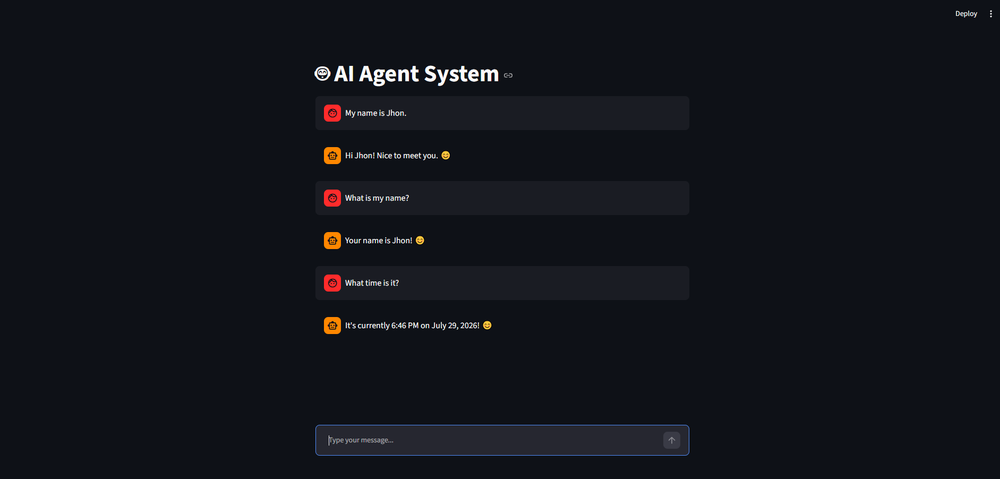

<div align="center">

# AI Agent System

### LangChain • FastAPI • React • Streamlit • Ollama

<br>


<br>


<br>


</div>

---

# Overview

AI Agent System is a portfolio project that demonstrates how to design and implement a modern AI application using software engineering best practices.

The project integrates a local Large Language Model running with Ollama, LangChain for orchestration, FastAPI for the backend, and both Streamlit and React as user interfaces.

Rather than focusing on a single feature, the repository demonstrates how the core components of an AI application work together through a clean, modular, and extensible architecture.

Current capabilities include:

- Multi-turn conversations
- Conversation memory
- LangChain Tool Calling
- Calculator Tool
- Clock Tool
- File Reader Tool
- FastAPI REST API
- Streamlit interface
- React interface
- Unit testing
- Integration testing


---

# Features

The AI Agent System demonstrates the architecture of a modern AI application built around a local Large Language Model. The project combines multiple technologies into a single end-to-end system while maintaining a modular software architecture.

The current implementation includes:

- 🤖 Conversational AI Agent powered by Ollama
- 🧠 Conversation memory across multiple interactions
- 🔧 LangChain Tool Calling
- ➕ Calculator Tool
- 🕒 Clock Tool
- 📄 Local File Reader Tool
- 🌐 FastAPI REST API
- ⚛️ React chat interface
- 🎈 Streamlit chat interface
- 🧪 Unit and integration testing
- ✅ Static analysis with Ruff and MyPy
- 📦 Modern dependency management with UV

---

# Technology Stack

| Category | Technologies |
|-----------|--------------|
| Programming Language | Python 3 |
| LLM Runtime | Ollama |
| LLM Framework | LangChain |
| Backend | FastAPI |
| Frontend | React + Vite |
| Rapid Prototyping UI | Streamlit |
| Data Validation | Pydantic |
| Testing | Pytest |
| Static Analysis | Ruff, MyPy |
| Package Management | UV |
| Version Control | Git & GitHub |

---

# Project Goals

This repository was built to understand how the major components of an AI application work together in a production-style architecture.

The project focuses on:

- Building an AI Agent using modern engineering practices.
- Understanding LangChain abstractions and Tool Calling.
- Designing a modular backend with FastAPI.
- Developing multiple user interfaces for the same backend.
- Applying software engineering principles such as abstraction, modularity, and separation of responsibilities.
- Creating a complete portfolio project that demonstrates practical AI engineering skills.

---


---

# System Architecture

The AI Agent System follows a modular architecture where each component has a single responsibility. The user interfaces communicate with a REST API, which delegates requests to the AI Agent responsible for conversation management, reasoning, and tool execution.

```
                         ┌──────────────────────┐
                         │        User          │
                         └──────────┬───────────┘
                                    │
                    ┌───────────────┴────────────────┐
                    │                                │
                    ▼                                ▼
         ┌──────────────────┐             ┌──────────────────┐
         │   React Frontend │             │ Streamlit UI     │
         └─────────┬────────┘             └─────────┬────────┘
                   │                                │
                   └──────────────┬─────────────────┘
                                  │
                                  ▼
                     ┌────────────────────────┐
                     │     FastAPI Backend    │
                     │       /chat API        │
                     └───────────┬────────────┘
                                 │
                                 ▼
                     ┌────────────────────────┐
                     │       ToolAgent        │
                     └───────────┬────────────┘
                                 │
                ┌────────────────┼────────────────┐
                │                │                │
                ▼                ▼                ▼
        ┌─────────────┐  ┌─────────────┐  ┌─────────────┐
        │Conversation │  │ LangChain   │  │   Tools     │
        │   Memory    │  │ Orchestration│ │ Calculator  │
        └─────────────┘  └──────┬──────┘ │ Clock       │
                                │        │ File Reader │
                                │        └─────────────┘
                                ▼
                      ┌──────────────────────┐
                      │      ChatOllama      │
                      │      Qwen3:4B        │
                      └──────────┬───────────┘
                                 │
                                 ▼
                      ┌──────────────────────┐
                      │   Local LLM Server   │
                      │       Ollama         │
                      └──────────────────────┘
```

## Architectural Highlights

- **Single backend** serving multiple user interfaces.
- **ToolAgent** encapsulates the reasoning workflow and tool orchestration.
- **Conversation** manages dialogue history independently of the language model.
- **ChatModel** abstracts the underlying LLM implementation.
- **PromptTemplate** isolates prompt generation from the Agent.
- **LangChain** provides Tool Calling and model orchestration.
- **FastAPI** exposes the Agent through a REST API.
- **React** and **Streamlit** consume the same backend without modifying the AI logic.


---

# Repository Structure

```
ai-agent-system/
│
├── docs/                   Project documentation
├── examples/               Example applications
├── images/                 README screenshots
├── react-chat/             React + Vite frontend
├── src/
│   └── ai_agent_system/
│       ├── tools/          LangChain tools
│       ├── agent.py
│       ├── api.py
│       ├── chat_model.py
│       ├── conversation.py
│       ├── langchain_prompt.py
│       ├── ollama_chat.py
│       ├── prompt.py
│       └── tool_agent.py
│
├── tests/
│   ├── integration/
│   ├── test_agent.py
│   ├── test_calculator.py
│   ├── test_clock.py
│   ├── test_conversation.py
│   ├── test_file_reader.py
│   ├── test_langchain_prompt.py
│   ├── test_prompt.py
│   ├── test_reasoning_workflow.py
│   └── test_tool_agent.py
│
├── .gitignore
├── pyproject.toml
├── README.md
└── uv.lock
```

---

# Quick Start

## 1. Clone the repository

```
git clone https://github.com/av-ml-ai-systems/ai-agent-system.git

cd ai-agent-system
```

## 2. Create and activate the Conda environment

```
conda create -n agent_env python=3.12

conda activate agent_env
```

## 3. Install the project dependencies

```
uv sync
```

## 4. Start Ollama

Make sure the Ollama server is running locally and that the required model has been downloaded.

Example:

```
ollama run qwen3:4b
```

## 5. Start the FastAPI backend

```
uv run uvicorn ai_agent_system.api:app --reload
```

The backend will be available at:

```
http://127.0.0.1:8000
```

## 6. Start the React interface

Open a second terminal.

```
cd react-chat

npm install

npm run dev
```

The React application will be available at:

```
http://localhost:5173
```

## 7. (Optional) Start the Streamlit interface

Open another terminal.

```
streamlit run examples/streamlit_chat.py
```


---

# User Interfaces

The AI Agent System exposes the same FastAPI backend through two independent user interfaces.

This demonstrates how a single AI backend can serve multiple frontend applications without modifying the core AI logic.

---

## React Interface

The React application provides a modern chat experience built with React and Vite.

Features:

- Interactive chat interface
- Real-time communication with the FastAPI backend
- Conversation history
- Automatic display of AI responses
- Clean and responsive user experience

<p align="center">
  
</p>

---

## Streamlit Interface

The Streamlit application offers a lightweight interface for rapid experimentation and AI prototyping.

Features:

- Simple chat interface
- Direct communication with the FastAPI backend
- Fast development workflow
- Ideal for testing and demonstrations

<p align="center">
  
</p>

---

## Backend

Both interfaces communicate with the same FastAPI REST API.

```
                React
                   │
                   │
                   ▼
             FastAPI API
                   ▲
                   │
                   │
              Streamlit
```

This architecture demonstrates the separation between presentation and business logic, allowing multiple clients to interact with the same AI Agent implementation.


---

# Testing

The project includes automated tests covering the core components of the system.

Current test suite includes:

- Agent behavior
- Conversation management
- Prompt generation
- LangChain prompt adapter
- Calculator Tool
- Clock Tool
- File Reader Tool
- ToolAgent
- Reasoning workflow
- Integration tests

Run the complete test suite with:

```
pytest
```

Run static analysis:

```
ruff check .

mypy src
```

---

# Learning Outcomes

This project demonstrates practical experience with:

- Large Language Models (LLMs)
- LangChain
- AI Agent architecture
- Tool Calling
- Prompt Engineering
- Conversation Memory
- FastAPI
- REST APIs
- React
- Streamlit
- Ollama
- Software Engineering
- Object-Oriented Programming
- Modular Architecture
- Unit Testing
- Integration Testing
- Git and GitHub

---

# Future Improvements

Possible future extensions include:

- Retrieval-Augmented Generation (RAG)
- Vector databases
- Persistent conversation memory
- Authentication
- Docker deployment
- Cloud deployment
- Multi-agent workflows
- Observability and monitoring
- CI/CD pipelines
- Kubernetes deployment

---

# Author

**Alvaro Vega**

Machine Learning Engineer • AI Engineer

GitHub:

https://github.com/av-ml-ai-systems

LinkedIn:

https://www.linkedin.com/in/alvarovegavargas/

---

If you found this repository useful, consider giving it a ⭐ on GitHub.
